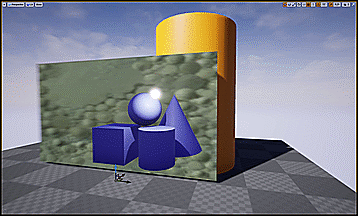

MagicUtilities
=======

A plugin for Unreal Engine 4 containing a variety of utilities as C++ code, Blueprints, Materials or a combination of them.

## Getting Started

### Engine Version

This plugin is currently under development under Unreal Engine 4.19 (UE 4.19), on Windows 10.
Using the plugin with a different version of Unreal may work, possibly also under Linux or Mac (definitely to be tested).

### Installing

In order to use this plugin, just download it from GitLab and put it in your project's Plugin folder. This should result in a folder structure like the following: `MyAmbitiousProject/Plugins/MagicUtilities`.

At this stage this plugin does not have dependencies.

Your project needs to be a C++ project. 
If that's not the case, you can go inside your project main folder, right click on your project file (`MyAmbitiousProject.uproject`) and select the Generate Visual Studio Project Files option (yes, Visual Studio - Windows only for now :) ). This will allow you to compile Uffmpeg and use it in your project.
If you want to try the same under Mac OS, there is going to be a similar option to generate an XCode project.

## Some of the Utilities

### ARScreen
(Materials + Material Functions + Blueprints)
Check the *ARScreen_Demo map*, located in the folder `MyAmbitiousProject/Plugins/MagicUtilities/Content/ARScreen/Maps`.
The ARScreen allows you to display 3D objects as seen through a window (ideally through a 3D plane). The objects will be shown only when looked at through this window. The purpose of the ARScreen is to create an AR experience _inside_ another 3D environment.

#### Usage:
- You can use the provided AR_StaticMeshActor to start creating your own ARObjects.
- _Note:_ ARObjects need to use the *masked* blend mode (this setting can be found among the settings for your materials). You can have optimized or non-optimized materials for your ARObjects. Optimized ARObjects materials use a less complex/redundant Material Function to generate their opacity mask, but won't work within UE4 in-editor simulation mode. This may be cumbersome during development. Non-optimized materials overcome this limitation at the cost of moving some code from the AR_VideoScreen to each ARObject material instance.
- Optimized and non-optimized Material Functions can be found in the `MyAmbitiousProject/Plugins/MagicUtilities/Content/ARScreen/MaterialFunctions` folder.
- A working AR_VideoScreen Actor is available. From the actor's settings you need to specify whether you are currently using optimized ARObjects materials or not. Once this Actor is in your environment, add some AR_StaticMeshActors behind it, and start playing/simulating your scene to look at ARObjects through it.
- If for any reason you need non-AR objects to be located between the AR_VideoScreen and any of your ARObjects, you can use the provided NonAR_StaticMeshActor and their dedicated NonARObject materials. These materials work exactly as the ARObject materials, but the opacity mask is inverted. 

### UGeometryUtilities
(C++, Blueprint Function Library)

C++ Geometry-related utilities: will grow as needed. You can use these functions also from within your Blueprints.

___
This utility is developed and maintained by [Dario Mazzanti](https://www.dariomazzanti.com).  
*This README file was last updated on 2019-01-24 by Dario Mazzanti.*

